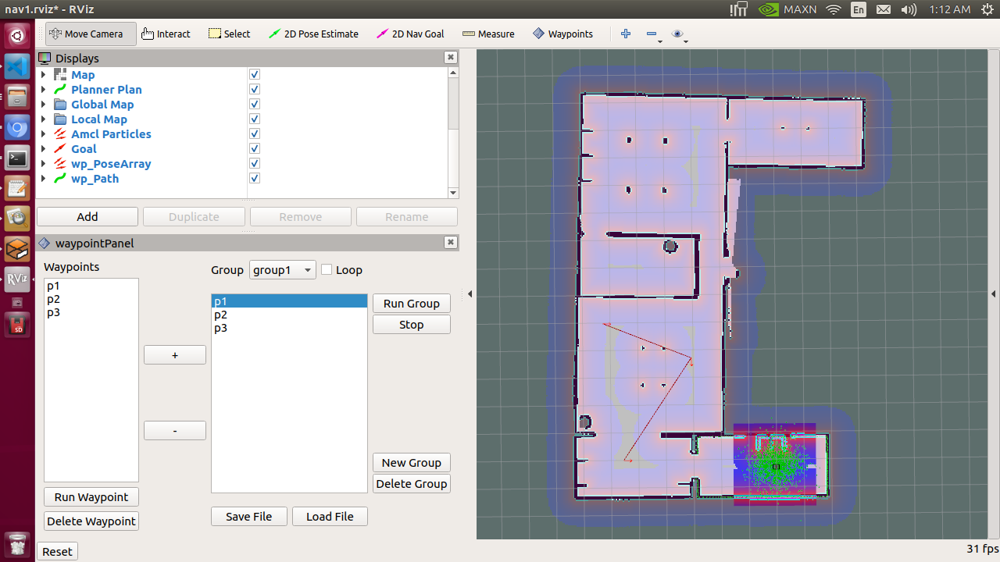
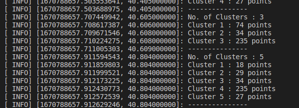
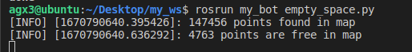

# Technical Assignment on ROS
## Contents

[Overview](#overview)

[Prerequisites](#prerequisites)

[Packages Overview](#packages-overview)

[Task 1](#task-1)

[Task 2](#task-2)


## Overview
In this project we will deal with two problem statements as mentioned in this [sheet](Technical_Assignment.pdf)

1. Setting up navigation stack for the Turtlebot3. Adding, saving, loading and ececuting the Waypoints.
2. Finding clusters using 2D Lidar data and finding empty space points in the given map.


## Prerequisites
- [ROS melodic](http://wiki.ros.org/melodic/Installation/Ubuntu)
- [ROS Navigation Package](http://wiki.ros.org/navigation)
- As in this project we use the turtlebot3 so make sure you have installed the ROS turtlebot3 and turtlebot3-msgs or else you can install them by using following commands 
    ```shell script
    sudo apt-get install ros-melodic-turtlebot3-msgs
    sudo apt-get install ros-melodic-turtlebot3
    ```
- Download this repo to your workspace src and build.
- Make sure that before using any terminal you have properly sourced your workspace and as we are using turtlebot3 for simulation, export the turtlebot model using following command.
    ``` shell script
    export TURTLEBOT3_MODEL=burger
    ```


## Packages Overview
- [my_bot](my_bot/) is consists of all the launch files and other files created to easy access of all packages.
- [obstacle_cluster_detection](obstacle_cluster_detection/) is the package used to find clusters.
- [turtlebot3_simulations](turtlebot3_simulations/) is used to provide the turtlebot3 simulation environment.
- [waypoints](waypoints/) is used to to perform the different operation related to waypoints, such as adding, saving, delecting, loading and executing wwaypoints.


## Task 1

To create a map using the map server use the following command
```shell script
roslaunch my_bot bot_mapping.launch
```

To move the turtlebot around the world to create map run the folling command in another terminal.
```shell script
roslaunch turtlebot3_teleop turtlebot3_teleop_key.launch
```

After creating map, to save use following command. You can give any name to map inspite of map1. This will save the map in [maps](my_bot/maps) folder
```shell script
roslaunch my_bot map_saver.launch map_name:=map1
```

Now we can close all terminals and to launch the waypoints task, use following command
```
roslaunch my_bot my_bot_nav.launch
```
You can view the following window where you can add, remove, save, load and execute the waypoints.
And the saved and load location is in [files](waypoints/files) floder.



## Task 2
### Sub Task 1
To find the realtime clusters using 2d lidar data, run the following command
```bash script
roslaunch my_bot cluster_finding.launch
```
You can view the number of clusters and number of points in each cluster as shown in the below



### Sub Task 2
To find the empty space points in any area, we need to have map of that area. So create a map of your required area using previous discussed methods.

And then when we have the map, we can publish the map using map server 


``` shell script
roslaunch my_bot map_server.launch
```

And to find & store the empty space points in [empty_space_points](my_bot/empty_space_points) folder run the following command

``` shell script
rosrun my_bot empty_space.py
```



View the saved points in this [file](my_bot/empty_space_points/point.txt)

